# Eksporter KART

Aplikacja przeznaczona jest dla Okręgowych Komisji Egzaminacyjnych, które chciałyby zautomatyzować proces eksportu kart i zdających, do aplikacji `ONE`, dla testowych lub szkoleniowych sesji oceniania.
Oparta jest o framework PHP [Laravel 11](https://laravel.com).

## Spis treści

1. [Eksporter KART](#eksporter-kart)
2. [Możliwości](#możliwości)
3. [Opis działania aplikacji Eksporter KART](#opis-działania-aplikacji-eksporter-kart)
4. [Funkcjonalności](#funkcjonalności)
   - [Użytkownicy](#użytkownicy)
   - [Repozytoria Kart Odpowiedzi](#repozytoria-kart-odpowiedzi)
   - [Eksportowanie kart odpowiedzi i zdających do systemu `ONE`](#eksportowanie-kart-odpowiedzi-i-zdających-do-systemu-one)
     - [Przygotowanie eksportu](#przygotowanie-eksportu)
     - [Generowanie pliku JSON z danymi zdających](#generowanie-pliku-json-z-danymi-zdających)
     - [Uruchamianie eksportu](#uruchamianie-eksportu)
     - [Proces eksportu](#proces-eksportu)
5. [Przydatne informacje o aplikacji Eksporter KART](#przydatne-informacje-o-aplikacji-eksporter-kart)
   - [Pliki logów](#pliki-logów)
   - [Konfiguracja aplikacji (plik .env)](#konfiguracja-aplikacji-plik-env)
6. [Licencja](#licencja)

## Możliwości

- Tworzenie repozytoriów kart.
- Tworzenie eksportów do `ONE` z dowolnego repozytorium kart.
- Dodawanie dostosowań dla importowanych do `ONE` zdających.
- Rozbudowany system powiadomień.
- Responsywny i nowoczesny interfejs.
- Obsługa motywów.
- Zarządzanie użytkownikami.
- Zarządzanie profilem użytkownika.
- Weryfikacja dwuetapowa użytkownika.
- Prosty deployment.

## Opis działania aplikacji Eksporter KART

Aplikacja jest przeznaczona do działania w wewnętrznej sieci OKE, tej samej, w której funkcjonuje linia skanująca ABBYY, połączona VPN z systemem `ONE`. Aplikacja nie komunikuje się bezpośrednio z `ONE`, ale wykorzystuje mechanizmy łączące linię skanującą ABBYY z tym systemem (tabela `ONE_XML`). Dodanie rekordu do tabeli, zawierającego odpowiednio spreparowany kod `XML`, uruchamia odpowiedni trigger, który zajmuje się właściwym eksportem.

## Funkcjonalności

### Użytkownicy

Instalacja tworzy domyślnego użytkownika aplikacji `admin` z hasłem `admin`, które należy zmienić po pierwszym logowaniu:

w `Administracja / Użytkownicy`

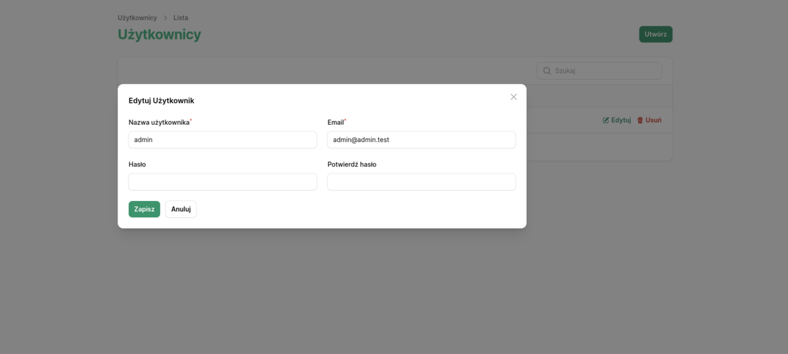

Rysunek 1. Widok edycji użytkownika.

lub w ustawieniach profilu:

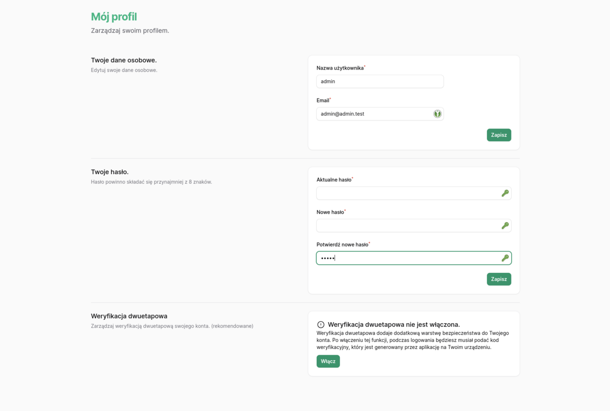

Rysunek 2. Widok zarządzania profilem użytkownika.

Istnieje również możliwość włączenia weryfikacji dwuetapowej (`2FA`).

### Repozytoria Kart Odpowiedzi

1. Tworzenie `Repozytorium Kart Odpowiedzi`.

    Aplikacja umożliwia tworzenie repozytoriów kart odpowiedzi (przycisk `Utwórz`).

    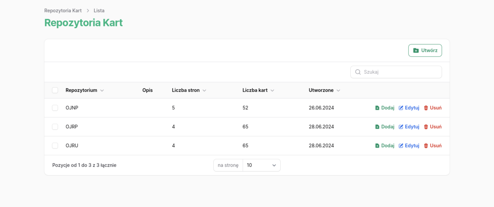

    Rysunek 3. Widok repozytoriów kart odpowiedzi.

    Tworząc `Repozytorium` musimy podać UNIKALNĄ nazwę repozytorium oraz liczbę stron kart odpowiedzi (wkładki do skanowania). Reguła nałożona na `nazwę repozytorium` wymaga, aby ciąg zaczynał się od dokładnie czterech dużych liter, po których opcjonalnie może wystąpić dodatkowa litera (lub dwie litery) z opcjonalną cyfrą lub tylko jedna cyfra. Np. `OJAP`, `MPOP1`, `MMAPR1`. Opis repozytorium jest opcjonalny i jest to jedyny parametr, który możemy edytować. Późniejsza zmiana nazwy lub liczby stron jest niemożliwa.

   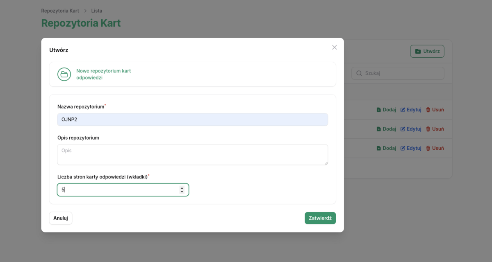

   Rysunek 4. Widok dodawania do repozytorium kart odpowiedzi.

2. Dodawanie `Kart Odpowiedzi` do `Repozytorium`.

    Za pomocą przycisku `Dodaj` wywołamy okno modalne, pozwalające na wybór plików (dpuszczalne są formaty: jpg, png, tiff).
    Nazwy plików muszą mieć następującą konwencję:

    IdZdajacego_NrStrony, np. Jeśli `Karta Odpowiedzi` ma 4 strony, to na kartę zdającego o Id `73456`, składają się pliki: `73456_1`, `73456_2`, `73456_3`, `73456_4`.
  
    Karty niekompletne lub duplikaty (to samo Id zdającego) nie zostaną dodane do repozytorium.
    Po każdej operacji dodawania kart do repozytorium (Import kart), system wysyła powiadomienie z podsumowaniem importu kart.

    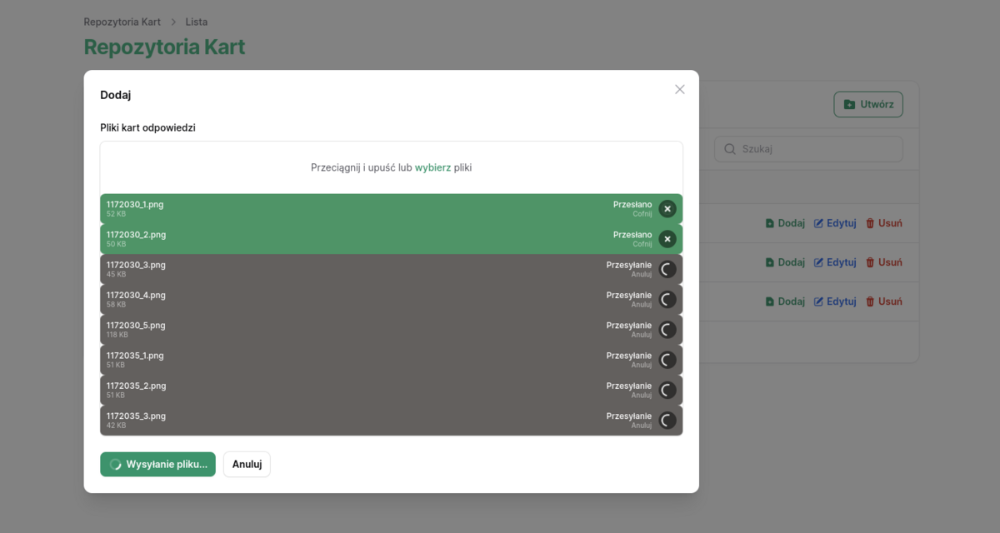

    Rysunek 5. Widok przesyłania plików kart odpowiedzi.

    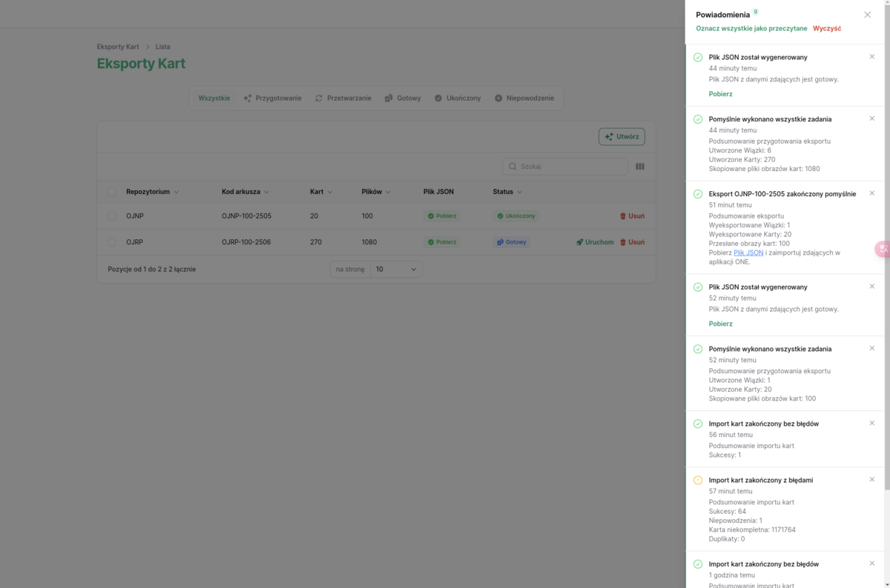

    Rysunek 6. Widok przykładowych powiadomień aplikacji.

3. Edycja repozytorium i usuwanie kart.

    W widoku `Edycji repozytorium` możemy dodać lub edytować `Opis` repozytorium. Możemy również usuwać wybrane karty (we wszystkich widokach możliwe są tzw. `akcje masowe`).

    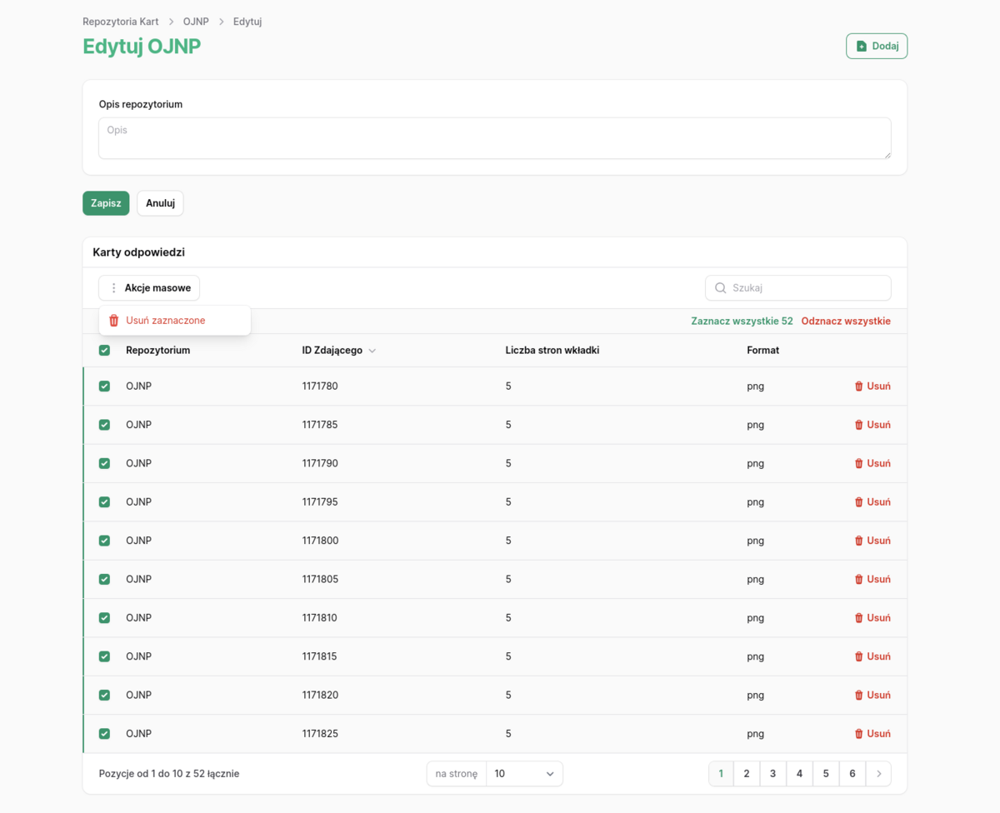

    Rysunek 7. Widok edycji repozytorium.

### Eksportowanie kart odpowiedzi i zdających do systemu `ONE`

#### Statusy eksportów

  Każdy eksport może przyjąć następujące `Statusy`:

- `przygotowanie` - ten status jest nadawany w momencie tworzenia eksportu. Na tym etapie aplikacja:
  - tworzy odpowiednie wpisy w bazie danych (tabele: `exports`, `bundles`, `cards`, `card_pages`),
  - powiela i kopiuje pliki kart odpowiedzi do udziału `SAMBA`, gdzie linia ABBYY zapisuje zeskanowane karty (*kopiowanie plików może zająć chwilę lub dwie, w zależności od ilości plików*),
  - po skopiowaniu plików, pojawia się nowa funkcjonalność `Generuj JSON` w rekordzie `Eksportu`,
  - wygenerowanie pliku JSON kończy etap `Przygotowania` eksportu.
- `Gotowy` - ten status nadawany jest po pomyślnym wykonaniu wszystkich zadań z poprzedniego etapu.
  - pojawia się nowa funkcjonalność `Uruchom` w rekordzie `Eksportu`.
- `Przetwarzanie` - aplikacja w tej fazie:
  - zapisuje kod `XML` w tabeli `ONE_XML`, dla każdej utworzonej wiązki kart, co uruchamia rzeczywisty przesył plików pomiędzy systemami.
  - po upływie `10 sekund`, uruchamia się kod sprawdzający postęp eksportu. Jeżeli eksport jeszcze się nie zakończył, kod sprawdzający zostanie uruchomiony ponownie, po upływie kolejnych `10 sekund`,
  - kod sprawdżający uruchamia się maksymalnie 4 razy, więc po upływie niecałej minutu, powinniśmy znać wynik naszych starań ;).
- `Ukończony` - ten status nadawany jest po pomyślnym wyeksportowaniu wszystkich wiązek kart odpowiedzi do `ONE`.
- `Niepowodzenie` - ten status jest nadawany, gdy przynajmniej jedna wiązka kart nie została pomyślnie wyeksportowana.
  - eksport o takim statusie, można uruchomić ponownie (**UWAGA**. *WSZYSKIE WIĄZKI ZOSTANĄ WYEKSPORTOWANE PONOWNIE!!!*).

#### Przygotowanie eksportu

  Przycisk `Utwórz` w widoku `Eksporty KART` pozwala na ustawienie wszystkich, wymaganych do przygotowania eksportu, parametrów.

  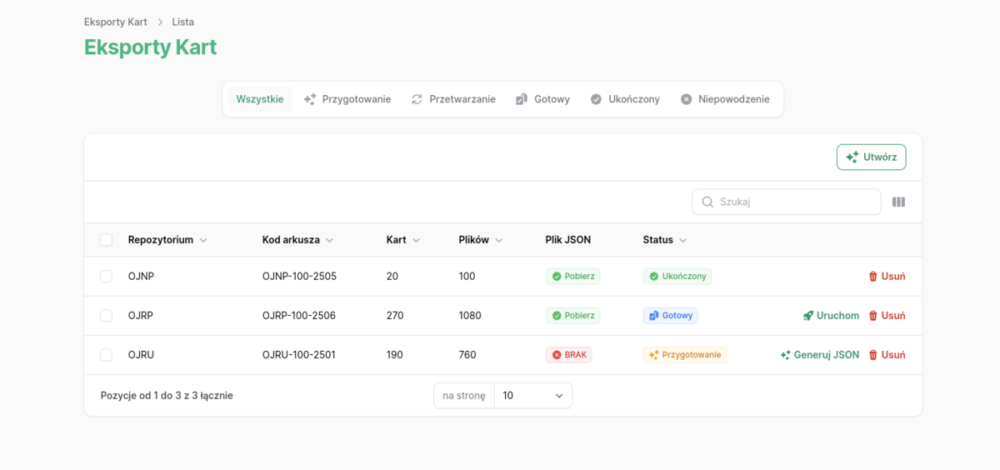

  Rysunek 8. Widok eksportów kart.  
  
  Są to:

  `Repozytorium` - repozytorium kart odpowiedzi, które ma posłużyć za szablony kart (wszystkie karty w repozytorium są powielane, jako inny zdający, wymagane do osiągnięcia `Docelowej liczby kart odpowiedzi` razy).

  `Kod arkusza`  - musi być identyczny z kodem arkusza `Sesji egzaminacyjnej` w systemie `ONE`.

  `OKE` - wybór OKE pozwala na ustawienie szkoły zdających, przypisanej do danej OKE.

  `Docelowa liczba kart odpowiedzi` - liczba kart i zdających jaką chcemy wyeksportować do `ONE`.

  `Liczba kart w wiązce` - podobnie jak w linii ABBYY, eksporter dzieli wszystkie karty na wiązki. Każda wiązka to w rzeczywistości oddzielny eksport. Domyślna wartość to `50`.

  `Opis eksportu` - informacje o eksporcie (opcjonale).

  `Dostosowania` - jeżeli chcemy przetestować coś związanego z dostosowaniami sprawdzania, możemy ustawić `Sposób dostosowań` poprzez podanie `Id` dostosowania lub dostosowań z systemu `ONE` i `Procent Kart z dostosowaniam` zdających, którzy mają mieć ustawione dostosowania (domyślnie 10%).

  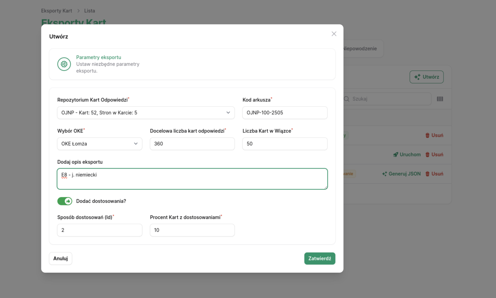

  Rysunek 9. Widok tworzenia nowego eksportu (przygotowanie eksportu).

  W procesie `Przygotowania eksportu` aplikacja wykonuje następujące czynności:
  
- Tworzy wpisy bazie danych (tabele: `exports`, `bundles`, `cards`, `card_pages`) odpowiadające parametrom podanym w formularzu.
  Wszystkie metadane związane z kartą zdającego i jej stronami, są zapisywane w bazie danych.
- Kopiuje pliki kart odpowiedzi do udziału `SAMBA`, gdzie linia ABBYY zapisuje zeskanowane karty.

  Ścieżka wygląda następująco: `UDZIAŁ_SAMBA\ROK\KODARKUSZA\IDWIĄZKI\KODSZKOŁY\IDZDAJĄCEGO\IDZDAJĄCEGO_NrStrony.png`. Np.:

  ```plaintext
  karty_odp_sioeo\2024\OJNP-100-2405\400011\206201-01K06\Z00451\Z00451_1.png
  karty_odp_sioeo\2024\OJNP-100-2405\400011\206201-01K06\Z00451\Z00451_2.png
  karty_odp_sioeo\2024\OJNP-100-2405\400011\206201-01K06\Z00451\Z00451_3.png
  karty_odp_sioeo\2024\OJNP-100-2405\400011\206201-01K06\Z00451\Z00451_4.png
  karty_odp_sioeo\2024\OJNP-100-2405\400011\206201-01K06\Z00451\Z00451_5.png
  ```

- Wysyła powiadomienie z podsumowaniem przygotowania eksportu.

#### Generowanie pliku JSON z danymi zdających

  Pomyślne wykonanie `przygotowania eksportu` skutkuje pojawieniem się przycisku `Generuj JSON`.

  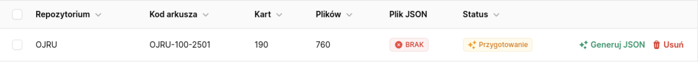

  Rysunek 10. Widok rekordu eksportu (widoczny przycisk `Generuj JSON`).

  Po kliknięciu przycisku, aplikacja w pierwszej kolejności wygeneruje kod `XML` dla każdej utworzonej wiązki i zapisze go w bazie (tabela `bundles`).
  
  **Struktura kodu `XML` dla wiązki zawierającej 1 kartę odpowiedzi**

  ```xml
  <Wiazka>
    <NazwaWiazka>ExportONE_40001</NazwaWiazka>
    <IdWiazka>400011</IdWiazka>
    <LiczbaKart>1</LiczbaKart>
    <Karty>
      <Karta>
        <PESEL>Z00001</PESEL>
        <KodSzkoly>206201-01K06</KodSzkoly>
        <KodArkusza>OJRP-100-2405</KodArkusza>
        <KartaId>Z00001_1</KartaId>
        <NumerStrony>01</NumerStrony>
        <FormatPliku>png</FormatPliku>
      </Karta>
      <Karta>
        <PESEL>Z00001</PESEL>
        <KodSzkoly>206201-01K06</KodSzkoly>
        <KodArkusza>OJRP-100-2405</KodArkusza>
        <KartaId>Z00001_2</KartaId>
        <NumerStrony>02</NumerStrony>
        <FormatPliku>png</FormatPliku>
      </Karta>
      <Karta>
        <PESEL>Z00001</PESEL>
        <KodSzkoly>206201-01K06</KodSzkoly>
        <KodArkusza>OJRP-100-2405</KodArkusza>
        <KartaId>Z00001_3</KartaId>
        <NumerStrony>03</NumerStrony>
        <FormatPliku>png</FormatPliku>
      </Karta>
      <Karta>
        <PESEL>Z00001</PESEL>
        <KodSzkoly>206201-01K06</KodSzkoly>
        <KodArkusza>OJRP-100-2405</KodArkusza>
        <KartaId>Z00001_4</KartaId>
        <NumerStrony>04</NumerStrony>
        <FormatPliku>png</FormatPliku>
      </Karta>
    </Karty>
  </Wiazka>
  ```
  
  Następnie generowany jest plik JSON i w kolumnie `Plik JSON` pojawia się przycisk `Pobierz`, a eksport zmienia status na `Gotowy` i pojawia się przycisk `Uruchom`. Plik ma następującą strukturę:
  
  ```json
  [
      {
        "id": "1",
        "pesel": null,
        "numerDokumentu": "Z00001",
        "kodZdajacego": "KOD",
        "kodSzkoly": "206201-01K06",
        "rspoSzkoly": "91406",
        "numerSali": "sala",
        "uprawnieniaDlaDostosowan": null,
        "sposobyDostosowan": null,
        "idDeklaracji": null
      },
      {
        "id": "2",
        "pesel": null,
        "numerDokumentu": "Z00002",
        "kodZdajacego": "KOD",
        "kodSzkoly": "206201-01K06",
        "rspoSzkoly": "91406",
        "numerSali": "sala",
        "uprawnieniaDlaDostosowan": null,
        "sposobyDostosowan": null,
        "idDeklaracji": null
      }
  ]
  ```

  Pobranie pliku, pozwala na zaimportowanie zdających do konkretrnej sesji egzaminacyjnej (arkusza, który wcześniej musi zostać skonfigurowany) i połączenie ich z kartami.

  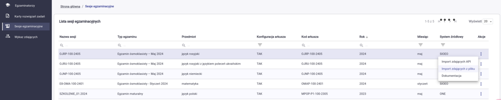

  Rysunek 11. Widok `Sesji egzaminacyjnych` - aplikacja `ONE`.

  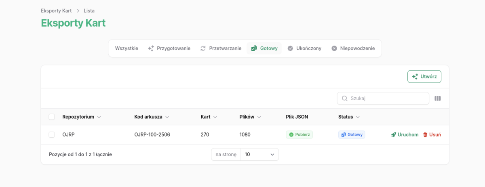

  Rysunek 12. Widok eksportów - status `Gotowy`.

#### Uruchamianie eksportu

  Przycisk `Uruchom` pojawia się wtedy, gdy eksport ma status `Gotowy` lub `Niepowodzenie`. Kliknięcie w rekord eksportu, przenosi do widoku `Podgląd eksportu`, gdzie widać więcej informacji dotyczących eksportu.
  
  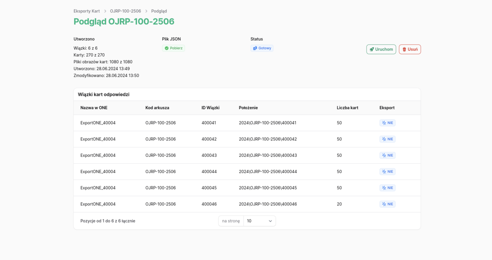

  *STATUS `Niepowodzenie` BĘDZIE MIAŁ KAŻDY EKSPORT, KTÓREGO CHOCIAŻ JEDNA WIĄZKA, NIE ZOSTAŁA WYEKSPORTOWANA.*

  *PONOWNE URUCHOMIENIE EKSPORTU, SPOWODUJE EKSPORT WSZYSTKICH WIĄZEK, NAWET TYCH WCZEŚNIEJ WYEKSPORTOWANYCH !!!*

  Uruchomienie eksportu wymaga potwierdzenia w oknie modalnym.

  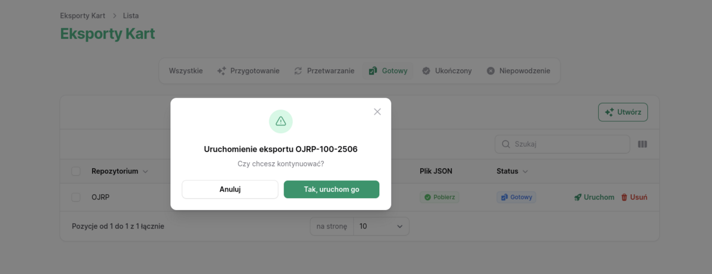

  Rysunek 14. Widok `Potwierdzenia uruchomienia eksportu`.

#### Proces eksportu

  Eksport kart odpowiedzi do sytemu `ONE`, odbywa się z wykorzystaniem rozwiązania firmy `DXC`, łączącego linię skanującą ABBYY z `ONE`. Aplikacja korzysta z jednej, jedynej tabeli: `ONE_XML`.

  **Struktura tabeli (DDL) `ONE_XML`.**

  ```sql
  CREATE TABLE "`ONE`_XML"(
    "ID" int IDENTITY(1,1) NOT NULL,
    xmlfile xml,
    "Id_`ONE`_stan_import_xml" int NOT NULL DEFAULT ((1)),
    err_nr nvarchar(50),
    err_message nvarchar(-1),
    conversation_handle_id nvarchar(64),
    "Id_wiazki" nvarchar(6),
    CONSTRAINT FK_Id_`ONE`_stan_import_xml FOREIGN key("Id_`ONE`_stan_import_xml") REFERENCES "`ONE`_stan_import_xml"(id)
  );
  CREATE INDEX `ONE`_XML_HANDLE_ID_IDX ON "`ONE`_XML"("conversation_handle_id");
  CREATE INDEX `ONE`_XML_WIAZKI_ID_IDX ON "`ONE`_XML"("Id_wiazki");
  ```

  

  Rysunek 15. Struktura tabeli `ONE_XML`.

  Dodanie rekordu do tabeli, z kodem `XML` (kolumna: `xmlfile`) uruchamia trigger zajmujący się właściwym przesyłem plików pomiędzy systemami. Aplikacja wstawia jeden rekord dla każdej wiązki kart odpowiedzi `Eksportu`.

  **Dane wstawiane do tabeli `ONE_XML`.**

  ```php
  $data = [
    'xmlfile' => $bundle->xml,
    'Id_`ONE`_stan_import_xml' => 1,
    ];
  ```

  **Sprawdzenie statusu eksportu.**

  Po `10 sekundach` od uruchomienia eksportu, worker uruchomi kod sprawdzający postęp eksportu. Jeśli eksport jeszcze się nie zakończył, kod sprawdzający zostanie uruchomiony ponownie, po upływie kolejnych `10 sekund`.
  Maksymalna liczba sprawdzeń to `4`.

  Zaleca się tworzenie eksportów z niezbyt dużą ilością kart odpowiedzi (plików kart odpowiedzi). Możliwe jest stworzenie kilku eksportów pod jeden, konkretny arkusz.

## Przydatne informacje o aplikacji `Eksporter KART`

### Pliki logów

- Logi workera (kolejki):

  log standardowego wyjścia: `/var/log/supervisor/eksporter-kart-worker.log`,

  log standardowego wyjścia błędów: `/var/log/supervisor/eksporter-kart-worker.err.log`,

  log `Supervisor`: `/var/log/supervisor/supervisord.log`.

- Log aplikacji `Eksporter KART`:

  `/var/www/eksporter-kart/storage/logs/laravel.log`.

- Log `PHP`:

  `/var/log/php8.3-fpm.log`.

- Logi `Nginx`:

  log dostępu: `/var/log/nginx/access.log`,

  log błędów:  `/var/log/nginx/error.log`.

### Konfiguracja aplikacji (plik `.env`)

  Większość ustawień aplikacji zawarta jest w pliku `/var/www/eksporter-kart/.env`. Przykładowy plik konfiguracji to `/var/www/eksporter-kart/.env.example`.

  Dla działania aplikacji w danej OKE, istotne są następujące zmienne:

#### Zmienne dla udziału `SMB`

- `SMB_HOST` - adres IP lub nazwa hosta z udziałem SMB,
- `SMB_PATH` - ścieżka do udziału SMB,
- `SMB_USERNAME` - nazwa użytkownika SMB,
- `SMB_PASSWORD` - hasło użytkownika SMB,
- `SMB_WORKGROUP` - nazwa grupy roboczej SMB.

#### Zmienne dla serwera `MS SQL`

- `SQLSRV_HOST` - adres IP lub nazwa hosta z MS SQL Server,
- `SQLSRV_USERNAME` - nazwa użytkownika MS SQL,
- `SQLSRV_PASSWORD`- hasło użytkownika MS SQL,
- `SQLSRV_DATABASE`- nazwa bazy danych MS SQL.

W katalogu `config` znajdują się pliki konfiguracyjne poszczególnych modułów frameworka `Laravel`. **Nie zalaca się dokonywania w nich zmian**.

## [Licencja](LICENCE.md)

OPROGRAMOWANIE TO JEST DOSTARCZANE PRZEZ CENTRALNĄ KOMISJĘ EGZAMINACYJNĄ, WŁAŚCICIELI PRAW AUTORSKICH ORAZ WSPÓŁTWÓRCÓW W STANIE "TAK JAK JEST". WSZELKIE WYRAŹNE LUB DOROZUMIANE GWARANCJE, W TYM TE, NIE OGRANICZAJĄCE SIĘ DO DOROZUMIANYCH GWARANCJI WARTOŚCI HANDLOWEJ I PRZYDATNOŚCI DO OKREŚLONEGO CELU, SĄ WYŁĄCZONE. W ŻADNYM WYPADKU CENTRALNA KOMISJA EGZAMINACYJNA, WŁAŚCICIELE PRAW AUTORSKICH ANI WSPÓŁTWÓRCY NIE PONOSZĄ ODPOWIEDZIALNOŚCI ZA JAKIEKOLWIEK BEZPOŚREDNIE, POŚREDNIE, PRZYPADKOWE, SPECJALNE, PRZYKŁADOWE LUB WYNIKOWE SZKODY (W TYM, ZAKUP ZASTĘPCZYCH TOWARÓW LUB USŁUG; UTRATA MOŻLIWOŚCI UŻYTKOWANIA, DANYCH LUB ZYSKÓW; PRZERWY W DZIAŁALNOŚCI), WYNIKAJĄCE W JAKIKOLWIEK SPOSÓB Z UŻYCIA TEGO OPROGRAMOWANIA, BEZ WZGLĘDU NA PRZYCZYNĘ I NA JAKIEJKOLWIEK TEORIE ODPOWIEDZIALNOŚCI, CZY TO UMOWNE, CZY Z DELIKTU (W TYM ZANIEDBANIA LUB INNEGO), NAWET JEŚLI NIE ZOSTALI POINFORMOWANI O MOŻLIWOŚCI WYSTĄPIENIA TAKICH SZKÓD.

(c) 2024 CENTRALNA KOMISJA EGZAMINACYJNA. Wszelkie prawa zastrzeżone.
